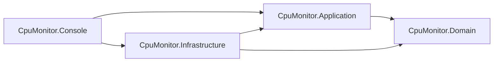
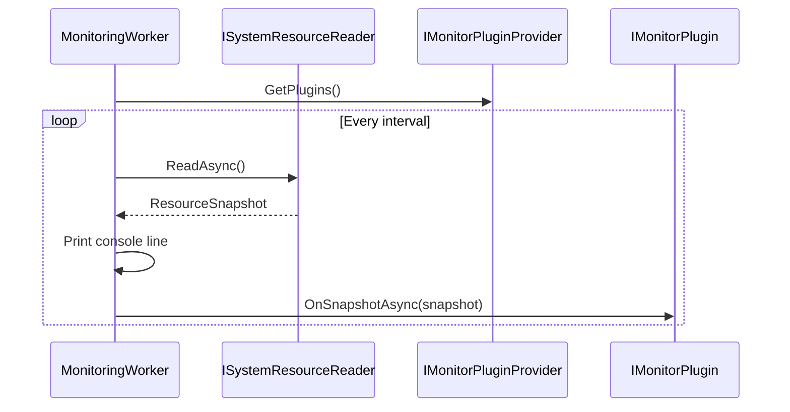

# Architecture

## Pattern

This solution uses Clean Architecture with dependency inversion. The business-facing contracts live at the center, while details such as Windows memory APIs, file I/O, HTTP calls, and plugin loading live in the outer Infrastructure layer.

## Project Layout

```text
CpuMonitor.sln
src/
  CpuMonitor.Domain/
    Models/
    Plugins/
    Services/
  CpuMonitor.Application/
    Options/
    Services/
  CpuMonitor.Infrastructure/
    Monitoring/
    Options/
    Plugins/
  CpuMonitor.Console/
    Program.cs
    appsettings.json
```

## Layer Responsibilities

`CpuMonitor.Domain` contains stable contracts and data models:

- `ResourceSnapshot`
- `DiskUsage`
- `ISystemResourceReader`
- `IMonitorPlugin`
- `IMonitorPluginProvider`

`CpuMonitor.Application` contains use-case orchestration:

- `MonitoringWorker` runs the timed monitoring loop.
- It reads a snapshot, writes readable console output, and dispatches the snapshot to each plugin.
- Plugin exceptions are isolated so one failed plugin does not stop monitoring.

`CpuMonitor.Infrastructure` contains external details:

- `SystemResourceReader` reads CPU, RAM, and disk data.
- `FileLoggingMonitorPlugin` appends samples to a local log file.
- `ApiPostMonitorPlugin` posts JSON to the configured REST endpoint.
- `ExternalPluginLoader` discovers extra plugin DLLs.
- `DependencyInjection` registers infrastructure services.

`CpuMonitor.Console` is the composition root:

- Loads JSON, environment variables, and command-line settings.
- Configures logging.
- Registers the worker and infrastructure dependencies.
- Starts the host.

## Dependency Direction



The Domain layer does not reference any outer layer. This lets new resource readers and plugins be added without changing the monitoring loop or core model.

## Plugin Flow



## Boundary Conditions

- The first CPU sample returns `0%` because the reader needs two samples to calculate a time delta.
- Process CPU reads can fail for protected or short-lived processes; those processes are skipped and logged at debug level.
- File logging creates its target directory when needed.
- HTTP errors are surfaced to the worker and logged, but they do not crash the application.
- Disk usage defaults to the drive containing the running application unless `Monitor:DiskRootPath` is set.

## Extension Points

- Add a platform-specific reader by implementing `ISystemResourceReader`.
- Add a new plugin by implementing `IMonitorPlugin`.
- Add Slack, database, or metrics integrations as plugins, keeping the monitor loop unchanged.
- Use configuration to enable/disable built-in integrations without changing code.
